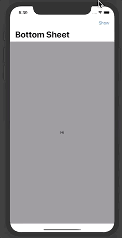

# BottomSheet


[](LICENSE)



## Requirements

iOS 13

## Usage

```swift
NavigationView {
    List(0..<20) {
        Text("\($0)")
    }
    .bottomSheet(isPresented: self.$isPresented, maxHeight: 300) {
        List(20..<40) { Text("\($0)") }
    }
    .navigationBarTitle("Bottom Sheet")
    .navigationBarItems(
        trailing: Button(action: { self.isPresented = true }) { Text("Show") }
    )
}
```
You can also set `topBarBackgroundColor` and `contentBackgroundColor` in `initializer` as you want.

## Example

To run the example project, clone this repo, and open iOS Example.xcworkspace from the iOS Example directory.

## Installation

### Swift Package Manager (Xcode 11+)

In `Xcode 11`, select `File` -> `Swift Packages` -> `Add Package Dependency`, enter the repo URL `https://github.com/weitieda/BottomSheet`


## Author

Tieda Wei


## License

BottomSheet is available under the MIT license. See [the LICENSE file](LICENSE) for more information.
