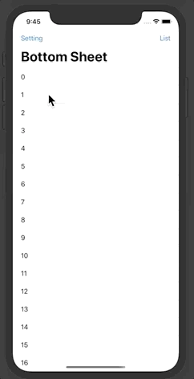

[](LICENSE)




## Requirements

iOS 13+

Swift 5.0

## Usage

Same way as you use `Sheet` in `SwiftUI`

```swift
NavigationView {
    List(0..<20) {
        Text("\($0)")
    }.listStyle(PlainListStyle())
    .bottomSheet(isPresented: $isPresented, height: 300) {
        List(20..<40) { Text("\($0)") }.listStyle(PlainListStyle())
    }
    .navigationBarTitle("Bottom Sheet")
    .navigationBarItems(
        trailing: Button(action: { self.isPresented = true }) {
            Text("Show")
        }
    )
}
```

## Example

> Both demo preview code are available in example project.

To run the example project, clone this repo, and open iOS Example.xcworkspace from the iOS Example directory.

## Installation
#### Swift Package Manager
To install `BottomSheet` using [Swift Package Manager](https://swift.org/package-manager/), add
`.package(name: "BottomSheet", url: "https://github.com/weitieda/bottom-sheet", from: "1.0.0"),"` to your Package.swift, then follow the integration tutorial [here](https://swift.org/package-manager#importing-dependencies).

#### CocoaPods
To install `BottomSheet` using [CocoaPods](http://cocoapods.org), add
`pod 'BottomSheet', :git => 'https://github.com/weitieda/bottom-sheet.git'` to your Podfile, then follow the integration tutorial [here](https://guides.cocoapods.org/using/using-cocoapods.html).

## Author

[Tieda Wei](https://tiedawei.com)

## License

BottomSheet is available under the MIT license. See [the LICENSE file](LICENSE) for more information.
